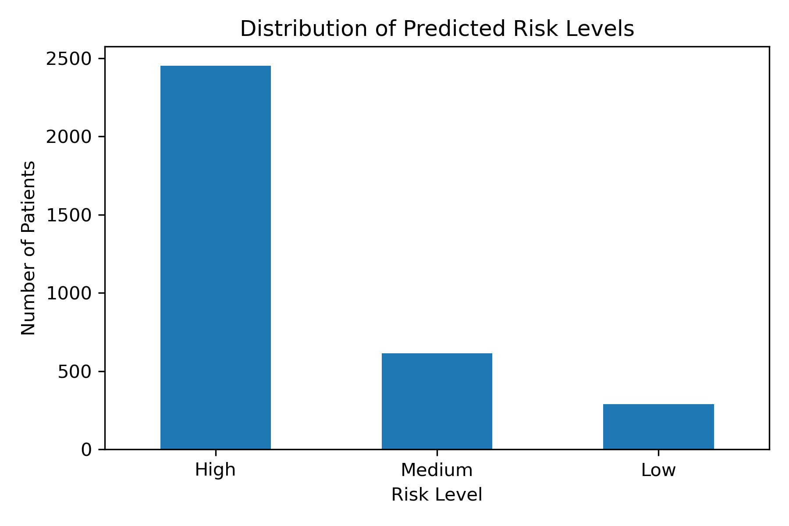
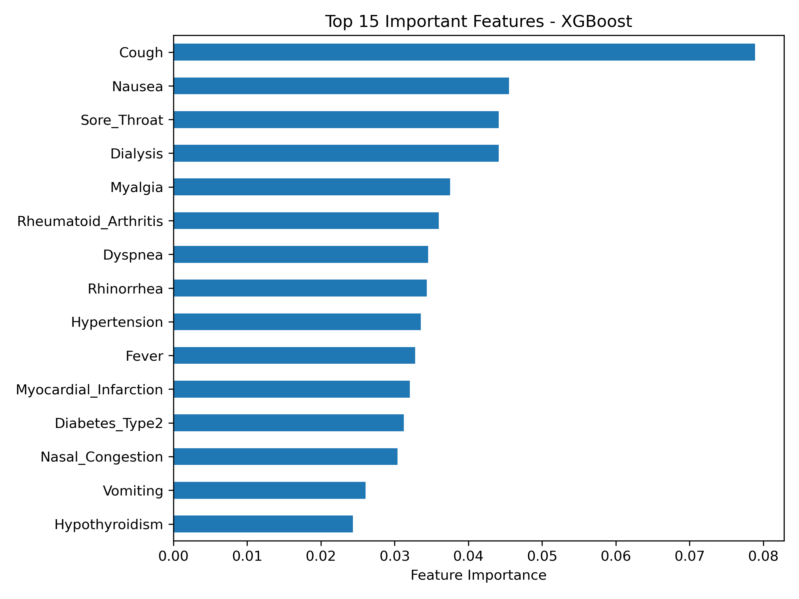

# 🧠 COVID-19 Risk Prediction System

A machine learning pipeline for **risk stratification of COVID-19 patients** based on clinical symptoms and medical history.

---

## 📌 Project Overview

This project aims to support early clinical decision-making by predicting the **risk level of severe COVID-19 involvement** using patient data.

Instead of providing a binary diagnosis, the system outputs a **probability-based risk score**, allowing clinicians to prioritize high-risk patients for further evaluation.

---

## 🎯 Objective

* Predict the likelihood of severe COVID-19 (using CT lung involvement as proxy)
* Handle highly imbalanced medical data
* Provide **interpretable and clinically useful outputs**

---

## ⚠️ Important Note

Due to the absence of explicit severity labels (e.g., ICU admission), **CT lung involvement** was used as a proxy for disease severity.

This system is designed as a:

> **Risk stratification tool (screening), NOT a diagnostic system**

---

## 📊 Dataset Characteristics

* Real-world clinical dataset (noisy, incomplete)
* Highly imbalanced target:

  * Severe cases ≪ Non-severe cases
* Mixed data types (categorical, binary, missing values)

---

## ⚙️ Pipeline

### 1. Feature Engineering

* Extracted symptom features (e.g., Fever, Cough, Dyspnea)
* Extracted past medical history (PMH)
* Cleaned and mapped raw columns into structured features

---

### 2. Target Definition

* Used CT scan lung involvement as severity indicator
* Converted to binary classification:

  * `1 → Lung involvement (high risk)`
  * `0 → No involvement`

---

### 3. Handling Class Imbalance

* Applied:

  * `class_weight='balanced'`
  * SMOTE (Synthetic Minority Oversampling Technique)
* Evaluated impact on recall and precision

---

### 4. Models Evaluated

* Logistic Regression
* Random Forest
* XGBoost ✅ (selected)
* LightGBM

---

### 5. Threshold Tuning

Instead of fixed 0.5 threshold:

* Evaluated thresholds: `0.1 → 0.5`
* Prioritized **recall for high-risk patients**

---

## 🧠 Final Approach

Reframed the problem as:

> **Risk Prediction instead of Binary Classification**

Model outputs:

* `Risk_Probability` (0–1)
* `Risk_Level`:

  * Low
  * Medium
  * High

---

## 📈 Results

### 🔹 Risk Distribution



---

### 🔹 Feature Importance (XGBoost)



---

### 🔹 Key Insight

* Models achieved **moderate recall for severe cases**
* Precision remains low due to extreme imbalance
* System is best suited for **screening and prioritization**

---

## 📁 Outputs

### 📄 Risk Predictions

```
outputs/risk_predictions.csv
```

Contains:

| Column           | Description                       |
| ---------------- | --------------------------------- |
| Patient_ID       | Unique patient identifier         |
| Risk_Probability | Predicted probability of severity |
| Risk_Level       | Low / Medium / High               |

---

## 🏥 Clinical Interpretation

This model provides a **risk score**, not a definitive diagnosis.

* **High Risk** → prioritize for CT scan / monitoring
* **Medium Risk** → follow-up recommended
* **Low Risk** → lower probability of severe involvement

---

## 🧪 Technologies Used

* Python
* Pandas / NumPy
* Scikit-learn
* XGBoost
* Matplotlib

---

## 🚀 Future Improvements

* Add more informative features (lab results, vitals)
* Improve label quality (ICU / hospitalization)
* Hyperparameter tuning
* Model explainability (SHAP)

---

## 👩‍💻 Author

**Atefeh Amjadian**
AI / Machine Learning Engineer

GitHub: https://github.com/Atefeh-Amjadian

---

## ⭐ Final Note

This project demonstrates the ability to:

* Work with messy real-world medical data
* Handle class imbalance
* Design clinically meaningful ML systems
* Move beyond naive classification into **decision-support systems**
